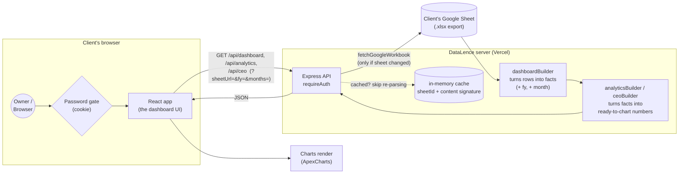

# DataLence — MIS Dashboard

DataLence turns a company's Google Sheets accounting export into a live, Power-BI-style
business dashboard. There's no database, nothing for the client to install, and no per-user
accounts — you connect a Google Sheet, the app reads it, and the dashboard shows sales,
customers, products, vendors, stock, expenses, and forecasts, including a 3-year CEO overview.

This document is written so that someone without a coding background can follow it end to end —
from receiving this project to handing a live, working link to a client. Wherever a term might
be unfamiliar, it's explained the first time it comes up.

**Read next, if you want more depth:**
- [`docs/PRD.md`](docs/PRD.md) — the Product Requirements Document: what the product does, who
  it's for, and what "done" looks like.
- [`docs/TRD.md`](docs/TRD.md) — the Technical Requirements Document: how it's built, the code
  layout, and the data pipeline.
- [`docs/datalence-flow.excalidraw`](docs/datalence-flow.excalidraw) — the original editable
  diagram (open it free at [excalidraw.com](https://excalidraw.com) → **Open** → pick this file).
  A rendered copy of it is right below.

**Google Sheet template:** `TODO — paste the link to the standardized client template sheet
here.` Every new client gets their own copy of this template (File → Make a copy in Google
Sheets) — never let a client edit the master template directly.

---

## How it works, in one picture



**Plain-language walkthrough:**
1. The owner opens the dashboard in their browser and logs in with one shared password.
2. The browser asks the server for data (e.g. "give me the CEO overview for FY 2025-26").
3. The server checks whether it already has a fresh copy of that Google Sheet cached in memory.
   If the sheet hasn't changed since the last check, it skips re-downloading it — this keeps the
   dashboard fast.
4. If it needs fresh data, the server downloads the sheet's `.xlsx` export (the same file you'd
   get from Google Sheets → File → Download → Microsoft Excel), turns every row into a
   structured "fact" (a sale, a payment, a purchase, etc.), then crunches those facts into the
   numbers each page needs.
5. The server sends that back as JSON (structured data), and the browser turns it into charts.

There is **no database anywhere** in this flow — the Google Sheet *is* the database. That's what
"stateless, direct-to-sheet" means in the technical docs.

---

## 1. Handing this project to a new client

Every client gets **their own GitHub repository** and **their own Vercel deployment**, built
fresh from this codebase. Do not simply copy the `.git` folder into the new repo — this repo's
history may contain a previous client's real business data in old commits, and we don't want
that following a new client around.

> A quick glossary if any of this is new: a **repo** ("repository") is a project's folder tracked
> by Git, hosted on GitHub. **Cloning** downloads a copy of a repo to your computer. **Pushing**
> uploads your local changes back up to GitHub.

```powershell
# 1. In GitHub, create a new, empty repository named for the client,
#    e.g. "datalence-<client-name>". (github.com → New repository)

# 2. Clone this source project into a new folder named after the client
git clone https://github.com/VihaanMa11/DATA-LENSE-MLH.git datalence-<client-name>
cd datalence-<client-name>

# 3. Remove the old project history so nothing from a previous client
#    (old commits, old data) comes along for the ride
Remove-Item -Recurse -Force .git
git init
git branch -M main
git remote add origin https://github.com/<your-github-username>/datalence-<client-name>.git

# 4. Commit everything as a fresh start and push it up
git add .
git commit -m "Initial commit: DataLence for <client name>"
git push -u origin main
```

That's it — you now have a clean, client-specific repository on GitHub with no history baggage.
Continue with the setup steps below **inside that new folder**.

---

## 2. What you need before you start

- **Node.js** version 20 or newer, and **npm** (npm comes bundled with Node). This is the
  software that runs the project on your computer. Download it from
  [nodejs.org](https://nodejs.org) if you don't have it.
- **The client's Google Sheet**, built from the standard template linked at the top of this
  file, and shared as **"Anyone with the link can view."** (In Google Sheets: **Share** → change
  "General access" to **Anyone with the link** → make sure it's set to **Viewer**.) The app
  reads the sheet's public export directly — there's no Google login or API key to set up.

---

## 3. Running it on your own computer (local development)

Open a terminal in the project folder and run:

```powershell
npm install
```

This downloads all the code libraries the project depends on — you only need to do this once
(and again any time the dependencies change).

Next, create your own environment file. An **environment file** (`.env`) holds secrets and
settings that shouldn't be committed to GitHub — like the dashboard's login password.

```powershell
Copy-Item .env.example .env
```

Open the new `.env` file in any text editor and fill in real values:

```
DASHBOARD_PASSWORD=<pick a real password for this client to log in with>
SESSION_SECRET=<a random string — see command below>
```

Generate a strong, random `SESSION_SECRET` (this is what keeps login sessions secure — it should
be random gibberish, not a word):

```powershell
node -e "console.log(require('crypto').randomBytes(32).toString('hex'))"
```

Copy the output into `SESSION_SECRET` in your `.env` file.

Now start the app:

```powershell
npm run dev
```

Open [http://localhost:5173](http://localhost:5173) in a browser. Log in with the
`DASHBOARD_PASSWORD` you set, open **Data Source** in the dashboard, paste the client's Google
Sheet URL, and click **Sync Now**. The dashboard should populate with the client's data.

To run the automated test suite (checks that the calculations behind every page are correct):

```powershell
npm test
```

---

## 4. Putting it live on the internet: deploying to Vercel via GitHub

[Vercel](https://vercel.com) is the hosting service this project is built for — it watches your
GitHub repo and automatically builds and publishes the site every time you push a change. The
project is already configured for it (`vercel.json` and `api/[...path].js`); you don't need to
write any deployment code.

1. **Make sure the client's repo is on GitHub** (done in Section 1 if you followed the handover
   steps).
2. Go to **[vercel.com/new](https://vercel.com/new)** and sign in — creating an account with the
   **same GitHub account** that owns the client's repo is the easiest path, since Vercel then
   lists your repos automatically.
3. Click **Import Project** (or **Add New… → Project**) and choose the client's repo
   (`datalence-<client-name>`).
4. Vercel will detect this is a Vite project and pre-fill the build settings. Leave them as-is:
   - **Build Command:** `npm run build`
   - **Output Directory:** `dist`
   - **Install Command:** `npm install`
5. **Before you click Deploy**, add the environment variables — this is the most important step
   and the one people forget. Open the **Environment Variables** section on the same import
   screen and add:

   | Key | Value |
   |---|---|
   | `DASHBOARD_PASSWORD` | the password this client will log in with |
   | `SESSION_SECRET` | a random 32+ character string (generate it the same way as in Section 3) |

   Apply both to **Production**, **Preview**, and **Development** so every deployment — not just
   the live one — works correctly.

   *(If you're adding these after the project already exists: go to
   **your project on vercel.com → Settings → Environment Variables** — that's always the place
   to find or change them later.)*

6. Click **Deploy**. Vercel builds the project and gives you a live URL
   (something like `datalence-<client-name>.vercel.app`) within a minute or two. From now on,
   every `git push` to the `main` branch automatically redeploys the live site, and every other
   branch or pull request gets its own preview link to test changes safely before they go live.
7. Open the live URL, log in with `DASHBOARD_PASSWORD`, connect the client's Google Sheet under
   **Data Source**, and click **Sync Now**. Hand that URL and password to the client.

### If you change an environment variable later

Vercel does **not** automatically apply an env var change to a deployment that's already built.
After editing a variable in **Settings → Environment Variables**, go to
**Deployments → (⋯ menu on the latest deployment) → Redeploy** to pick it up.

### Adding the client's own domain name (optional)

**Your project on vercel.com → Settings → Domains → Add**, type the domain the client owns
(e.g. `dashboard.clientcompany.com`), and Vercel will show you the exact DNS record to add at
the client's domain registrar.

---

## 5. Environment variables — what they're for

| Variable | Required? | What it does |
|---|---|---|
| `DASHBOARD_PASSWORD` | Yes | The one shared password that unlocks the dashboard. There are no individual user accounts — everyone at the client uses this same password. |
| `SESSION_SECRET` | Strongly recommended | A random string used to sign the login cookie so it can't be forged. If left unset, the app falls back to using `DASHBOARD_PASSWORD` for this too, which is weaker — always set it explicitly for a real client. |
| `PORT` | No | Only affects local development (which port `npm run dev` listens on, default `5173`). Vercel ignores this. |

Nothing else is required. There's no database connection string and no third-party API key —
the client's Google Sheet is the only data source, and it's read over a plain public URL.

---

## 6. Where things live in this project

```
server/     Express API — login, fetching/parsing the Google Sheet, one file per dashboard page's calculations
src/        The React (Vite) frontend — pages, charts, and the hooks that call the API
api/        The Vercel entry point that wraps server/ so it runs as a serverless function
docs/       PRD.md, TRD.md, and the flow diagram — read these for the full picture
test/       Automated tests (npm test) — one suite per calculation module in server/
```

For the exact Google Sheet tab names and columns the app expects (so you can validate a new
client's sheet before connecting it), see **§6.2 "Standardized workbook format"** in
[`docs/PRD.md`](docs/PRD.md).
